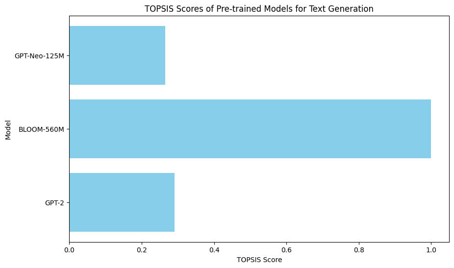

# Text Generation Model Comparison using TOPSIS

This project evaluates and compares three popular pre-trained language models for text generation using the **TOPSIS (Technique for Order of Preference by Similarity to Ideal Solution)** method. The models compared are:
- GPT-2
- GPT-Neo-125M
- BLOOM-560M

The evaluation is based on:
- **Inference Time**: Time taken by each model to generate text.
- **Perplexity**: A measure of how well a probability model predicts a sample.
- **Output Quality**: A proxy score based on word count, representing text fluency.

## Project Overview

1. **Models and Tokenizers**: The project uses the `transformers` library to load pre-trained models and their corresponding tokenizers.
2. **Text Generation**: The models are used to generate a continuation of a given prompt.
3. **Evaluation Metrics**: 
   - **Inference Time**: Measured in seconds for generating 50 tokens.
   - **Perplexity**: Calculated using the model's log loss.
   - **Output Quality**: A dummy metric based on the word count ratio.
4. **TOPSIS Method**: The three models are ranked based on their performance using the TOPSIS method, where:
   - **Inference Time** and **Perplexity** are considered negative impacts (lower values are better).
   - **Output Quality** is a positive impact (higher values are better).
5. **Visualization**: A bar plot is generated to visualize the TOPSIS scores of each model.

## Requirements

- Python 3.x
- PyTorch
- Hugging Face `transformers`
- Pandas
- Matplotlib
- NumPy

You can install the required dependencies by running the following command:

```bash
pip install torch transformers pandas matplotlib numpy
```

## Download the Project

You can download the project files directly from the repository.

## Results

Here is the bar plot showing the TOPSIS scores of each model:



